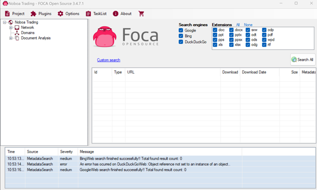
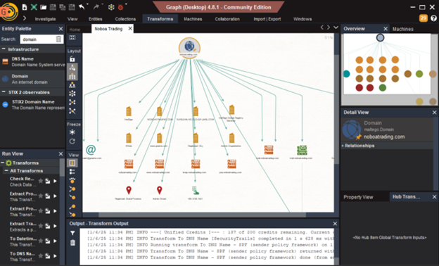
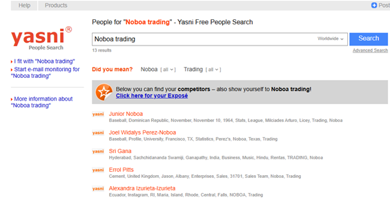

# 🕵️‍♀️ Investigación OSINT – Noboa Trading

## 🇪🇸 Descripción

Este proyecto documenta una investigación OSINT sobre Noboa Trading, empresa ecuatoriana dedicada a la exportación de banano. Se aplicaron técnicas pasivas para analizar su huella digital, identificar riesgos asociados a la información pública y proponer medidas de protección.

## 🇬🇧 Overview

This project documents an OSINT investigation on Noboa Trading, an Ecuadorian banana export company. Passive techniques were used to analyze its digital footprint, identify risks from public information, and propose protective measures.

---

## 🧰 Herramientas / Tools Used

- 🔍 Google Dorks  
- 🧠 FOCA (metadata analysis)  
- 🕸️ Maltego (network mapping)  
- 🔎 Yasni & Spokeo (people search)

---

## 📚 Documentación / Documentation

| Archivo | Descripción | Idioma |
|--------|-------------|--------|
| [`osint_report_ES.md`](./docs/osint_report_ES.md) | Informe técnico completo | Español 🇪🇸 |
| [`osint_report_EN.md`](./docs/osint_report_EN.md) | Full translated report | English 🇬🇧 |
| [`conclusions_ES_EN.md`](./docs/conclusions_ES_EN.md) | Conclusión bilingüe | ES / EN 🇪🇸🇬🇧 |

---

## 🖼️ Evidencias / Evidence

### 📄 Metadatos extraídos con FOCA  

### 🧬 Mapeo de relaciones con Maltego  

### 🔍 Resultados en Yasni  

---

## 📎 Referencias

- [FOCA Tool](https://www.elevenpaths.com/labstools/foca/index.html)
- [Maltego](https://www.paterva.com/)
- [Google Dorks Cheat Sheet](https://www.exploit-db.com/google-dorks)
- [Yasni](https://www.yasni.com)
- [Spokeo](https://www.spokeo.com)
